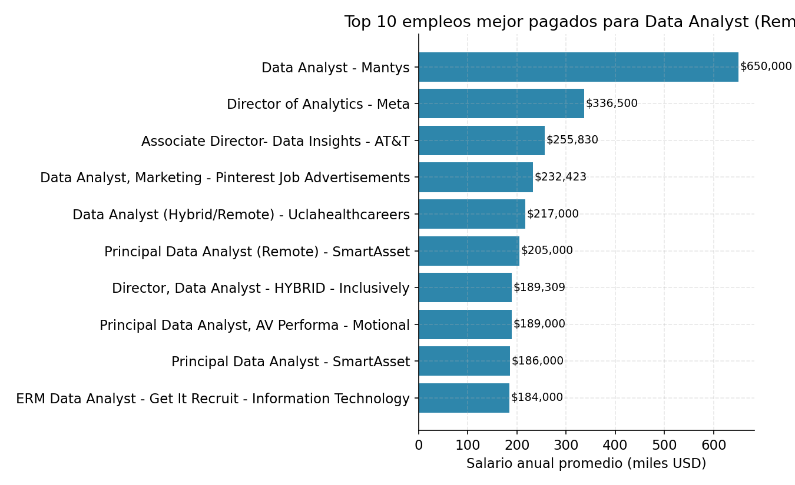

# Introduction

This project analyzes the job market for the Data Analyst role, aiming to identify the highest-paying jobs, the skills they require, the most in-demand skills overall, and — most importantly for decision-making — which skills are worth prioritizing by combining high demand with high pay.

The entire analysis was built from SQL queries run against a job postings database (2023 listings), with results exported to 5 CSV files. You can review the original queries in the [`/sql_queries`](/sql_queries/) folder.

Questions this analysis answers:

Questions this analysis answers:
1. What are the top 10 highest-paying Data Analyst jobs?
2. What skills do those top-paying jobs require?
3. What are the most in-demand skills for Data Analysts?
4. Which skills are associated with the highest salaries?
5. What are the optimal skills to learn (best balance of demand and salary)?

# Background

Driven by the interest in better understanding the Data Analyst job market and making informed decisions about which skills to develop, this project came from the need to go beyond intuition and answer with data: which skills actually pay more? which ones open the most opportunities?

**Data source:** a job postings database (`job_postings_fact`, `skills_job_dict`, `skills_dict` — typical naming for this kind of dataset), containing:
- Job title, location, schedule type
- Average annual salary (`salary_year_avg`)
- Posting date
- Hiring company
- Skills associated with each posting

The analysis focused exclusively on **Data Analyst** roles with remote work (`job_location = 'Anywhere'`) to keep postings comparable.


# Tools

For this project, I used:

- **SQL** — the core language of the analysis; allowed me to filter, join, and aggregate data from the jobs and skills tables.
- **PostgreSQL** — the database engine used to run the queries.
- **Visual Studio Code** — for managing queries and the project repository.
- **Git and GitHub** — version control and publishing the project as a portfolio piece.
- **Python (pandas, matplotlib)** — for final processing of the exported CSVs and generating the visualizations that accompany this document.


# The Analysis

Each SQL query in this project was designed to answer a specific question about the Data Analyst job market. Below are the findings for each results file.

### 1. Highest-paying Data Analyst jobs

Filtering remote postings (`job_location = 'Anywhere'`) and sorting by `salary_year_avg` in descending order:

``` sql
SELECT 
    job_postings_fact.job_id,
    job_postings_fact.job_title,
    job_postings_fact.job_location,
    job_postings_fact.job_schedule_type,
    job_postings_fact.salary_year_avg,
    job_postings_fact.job_posted_date,
    company_dim.name AS company_name
FROM
    job_postings_fact
LEFT JOIN company_dim ON job_postings_fact.company_id = company_dim.company_id
WHERE 
    job_title_short='Data Analyst' AND
    job_location='Anywhere' AND
    salary_year_avg IS NOT NULL
ORDER BY
    salary_year_avg DESC
LIMIT 10
```




- The salary range spans from **$184,000** to **$650,000** per year.
- The **Data Analyst** role at **Mantys** ($650,000) is an outlier: it's nearly double the second-highest salary, so it should be treated with caution when drawing general conclusions.
- There's a strong presence of senior/leadership titles (*Director of Analytics*, *Associate Director*, *Principal Data Analyst*) among the top earners, indicating that seniority explains much of the salary variation.
- **SmartAsset** appears twice in the top 10, suggesting a competitive and consistent pay policy for this role.

### 2. Skills required in the highest-paying jobs

Of the 10 jobs above, **8 had skills recorded** in the database (Mantys and Meta had none, likely due to `NULL` values in the skills table):

``` sql
WITh top_paying_jobs AS (
    SELECT 
        job_id,
        job_title,
        salary_year_avg,
        name AS company_name
    FROM
        job_postings_fact
    LEFT JOIN company_dim ON job_postings_fact.company_id = company_dim.company_id
    WHERE 
        job_title_short='Data Analyst' AND
        job_location='Anywhere' AND
        salary_year_avg IS NOT NULL
    ORDER BY
        salary_year_avg DESC
    LIMIT 10
)

SELECT
    top_paying_jobs.*,
    skills
FROM 
    top_paying_jobs
INNER JOIN skills_job_dim ON top_paying_jobs.job_id=skills_job_dim.job_id
INNER JOIN skills_dim ON skills_job_dim.skill_id=skills_dim.skill_id
ORDER BY 
    salary_year_avg DESC
``` 


- **SQL** appears in 100% of postings with recorded skills (8 of 8) — it's a virtually universal requirement, even for the most senior, best-paid roles.
- **Python** appears in 87.5% (7 of 8).
- **Tableau** appears in 75% (6 of 8), followed by **R** at 50%.
- Collaboration/DevOps tools (**Bitbucket, Atlassian, Jira, Confluence**) cluster in the same 2-3 roles (Director and Inclusively), suggesting that more "leadership-oriented" positions also value integration with engineering workflows, not just pure analysis.

### 3. Most in-demand skills in the market

Expanding the analysis to all Data Analyst postings (not just the top-paying ones):
``` sql
SELECT 
    skills,
    COUNT(skills_job_dim.job_id) AS demand_count
FROM
    job_postings_fact
INNER JOIN skills_job_dim ON job_postings_fact.job_id=skills_job_dim.job_id
INNER JOIN skills_dim ON skills_job_dim.skill_id=skills_dim.skill_id
WHERE 
    job_title_short='Data Analyst'
GROUP BY
    skills
ORDER BY
    demand_count DESC
LIMIT 5

``` 


| Skill | Postings requesting it |
|---|---:|
| SQL | 92,628 |
| Excel | 67,031 |
| Python | 57,326 |
| Tableau | 46,554 |
| Power BI | 39,468 |

- **SQL is by far the most requested skill** in the market, with nearly 38% more mentions than the runner-up (Excel).
- Notably, **Excel** outranks **Python** in total demand — confirming it remains an essential tool for the role, beyond the "modern" programming tools.
- Visualization tools (**Tableau** and **Power BI**) together account for over 86,000 mentions, confirming that data communication (not just analysis) is a core requirement of the role.

### 4. Highest-paying skills

``` sql
SELECT 
    skills,
    ROUND(AVG(salary_year_avg),2) AS avg_salary
FROM
    job_postings_fact
INNER JOIN skills_job_dim ON job_postings_fact.job_id=skills_job_dim.job_id
INNER JOIN skills_dim ON skills_job_dim.skill_id=skills_dim.skill_id
WHERE 
    job_title_short='Data Analyst' AND 
    salary_year_avg IS NOT NULL
GROUP BY
    skills
ORDER BY
    avg_salary DESC
LIMIT 25
``` 


- The skills with the highest average salary are **not** the most in-demand ones: they're highly specialized tools (**SVN, Solidity, Couchbase, DataRobot, Golang**), likely tied to hybrid roles (data engineering, blockchain, ML engineering) rather than "pure" Data Analyst positions.
- **SVN** stands out at $400,000 average, but since it appears in very few postings (low `n`), this is a case of **high statistical variance** — it shouldn't be read as a representative market trend, but as a one-off finding from 1-2 outlier postings.
- Machine learning tools (**Keras, PyTorch, TensorFlow, Hugging Face**) consistently rank in the top third, confirming that the intersection of data analysis and ML remains the most lucrative specialization path.

### 5. Optimal skills (demand × salary)

Cross-referencing demand (`demand_count > 10`) with average salary, to find the best balance between "employable" and "well-paid":

``` sql
WITH skills_demand AS (
    SELECT 
        skills_dim.skill_id,
        skills_dim.skills,
        COUNT(skills_job_dim.job_id) AS demand_count
    FROM
        job_postings_fact
    INNER JOIN skills_job_dim ON job_postings_fact.job_id=skills_job_dim.job_id
    INNER JOIN skills_dim ON skills_job_dim.skill_id=skills_dim.skill_id
    WHERE 
        job_title_short='Data Analyst' AND
        salary_year_avg IS NOT NULL AND
        job_work_from_home = TRUE
    GROUP BY
        skills_dim.skill_id
), average_salary AS (
    SELECT 
        skills_job_dim.skill_id,
        ROUND(AVG(job_postings_fact.salary_year_avg),2) AS avg_salary
    FROM
        job_postings_fact
    INNER JOIN skills_job_dim ON job_postings_fact.job_id=skills_job_dim.job_id
    INNER JOIN skills_dim ON skills_job_dim.skill_id=skills_dim.skill_id
    WHERE 
        job_title_short='Data Analyst' AND 
        salary_year_avg IS NOT NULL
    GROUP BY
        skills_job_dim.skill_id
)

SELECT 
    skills_demand.skill_id,
    skills_demand.skills,
    demand_count,
    avg_salary
FROM
    skills_demand
INNER JOIN average_salary ON skills_demand.skill_id=average_salary.skill_id
WHERE
    demand_count>10
ORDER BY
    avg_salary DESC,
    demand_count DESC
LIMIT 25
``` 


- **SQL** (398 mentions, $96,435 average) and **Python** (236 mentions, $101,512 average) dominate the ideal quadrant: **high demand + strong salary**. They're the non-negotiable foundation of a Data Analyst's toolkit.
- **Tableau** (230 mentions, $97,978) and **R** (148 mentions, $98,708) follow closely, confirming their relevance in both adoption and compensation.
- The most interesting finding is a group of **growing niche skills**: **Snowflake** (37 mentions, $111,578), **Azure** (34, $105,400), and **AWS** (32, $106,440) have lower absolute demand but a *better average salary* than SQL or Python — cloud/data warehouse tools are what's pushing compensation upward.
- **Looker** (49 mentions, $103,855) positions itself as a niche alternative to Tableau/Power BI with a better associated salary, though adoption is still limited.

# What I Learned

Throughout this project, I reinforced and developed several technical and analytical skills:

- **Advanced SQL**: using multiple `JOIN`s between the jobs and skills tables, aggregations (`COUNT`, `AVG`), and complex filtering/sorting (`WHERE`, `ORDER BY`, `LIMIT`) to answer concrete business questions, not just pull data.
- **Real-world data analysis**: I learned to detect and communicate outliers (like the $650,000 salary or the SVN figure) instead of hiding or ignoring them — something critical in any BI report.
- **Data integrity**: finding that 2 of the top 10 highest-paying jobs had no recorded skills forced me to think about the type of `JOIN` used and its implications (an `INNER JOIN` can silently exclude relevant information).
- **Data storytelling**: turning raw SQL result tables into visualizations that communicate a clear finding (for example, the demand-vs-salary scatter plot) is just as important as the query itself.
- **Strategic thinking about skills**: understanding that "most in-demand" and "highest-paid" are two distinct axes — and that the real value lies at their intersection — is a framework applicable to any career-development decision in data.

# Conclusion

This analysis confirms that **SQL and Python are the non-negotiable foundation** for anyone looking to maximize both employability and salary as a Data Analyst: they have the best combination of high demand and strong compensation. **Tableau** and **Excel** remain essential for communicating insights, while cloud tools like **Snowflake, Azure, and AWS** represent the clearest path to the next salary tier once the basics are mastered.

For someone planning their professional development, the data-driven recommendation is clear:
1. Master **SQL + Python + Excel** as the foundation (high demand, low risk).
2. Add a visualization tool (**Tableau** or **Power BI**).
3. Specialize in a cloud/data warehouse stack (**Snowflake, AWS, or Azure**) to access the next salary tier.

This project shows how SQL, combined with critical analysis of the results (not just query execution), can be turned into actionable insight — whether for an individual professional planning their career, or for a talent team defining hiring requirements.

# Credits

This project was built while following the course "SQL for Data Analytics - Learn SQL in 4 Hours" by Luke Barousse, who also provided the job postings dataset used in this analysis. All credit for the course structure, the dataset, and the original methodology goes to him — this repository reflects my own practice and analysis on top of that material.
 [YouTube Channel](https://www.youtube.com/watch?v=7mz73uXD9DA&t=12944s)
